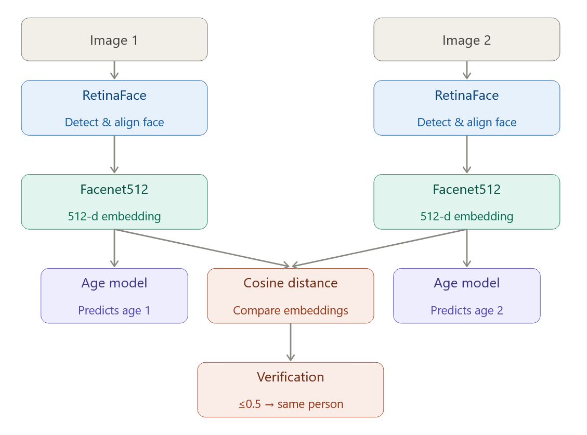
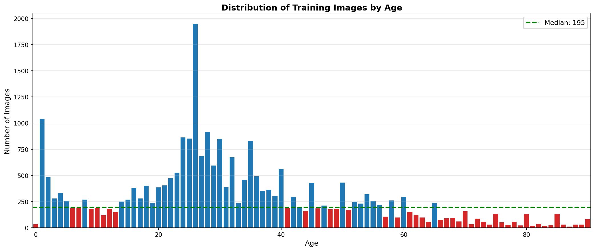
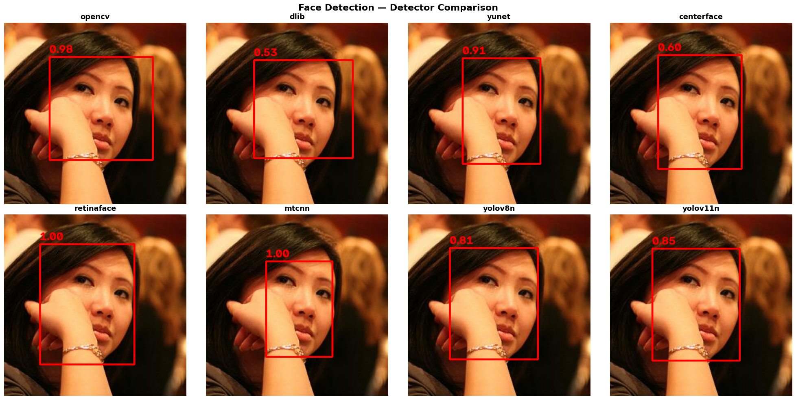
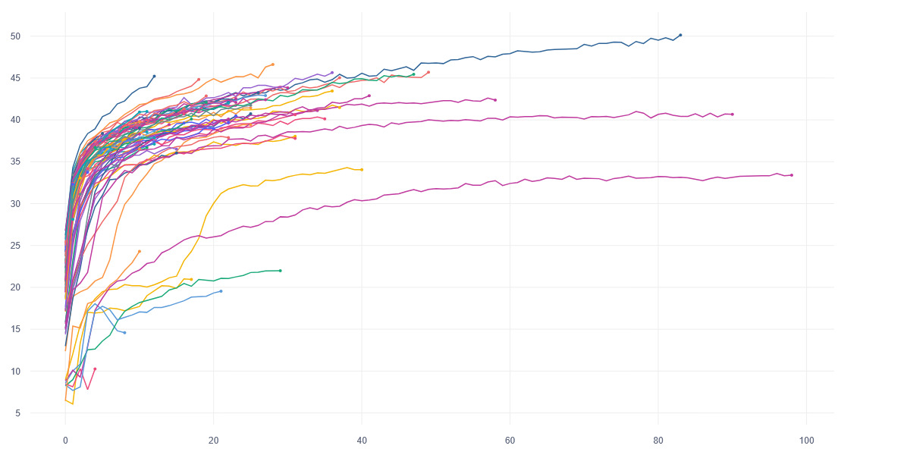
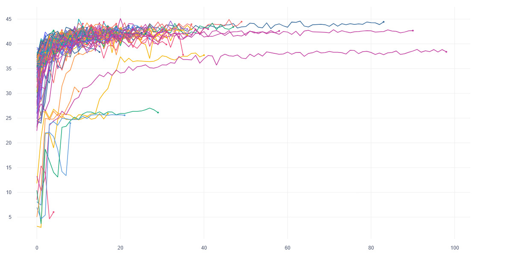
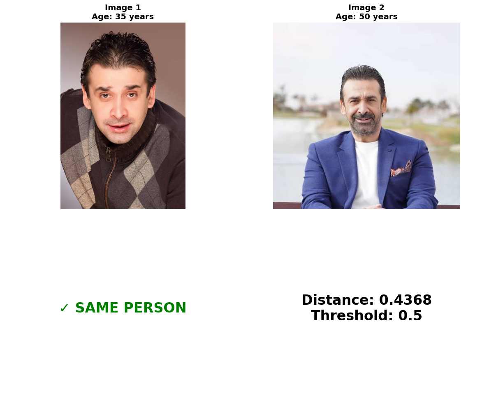
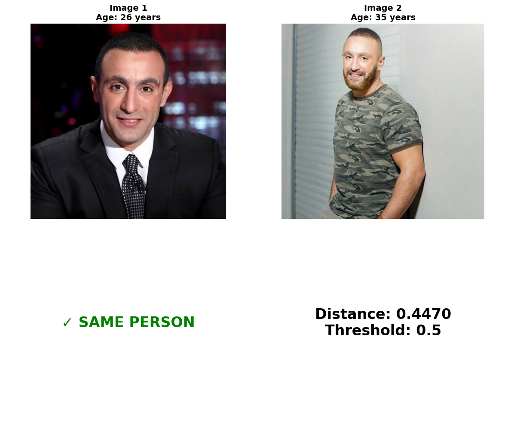
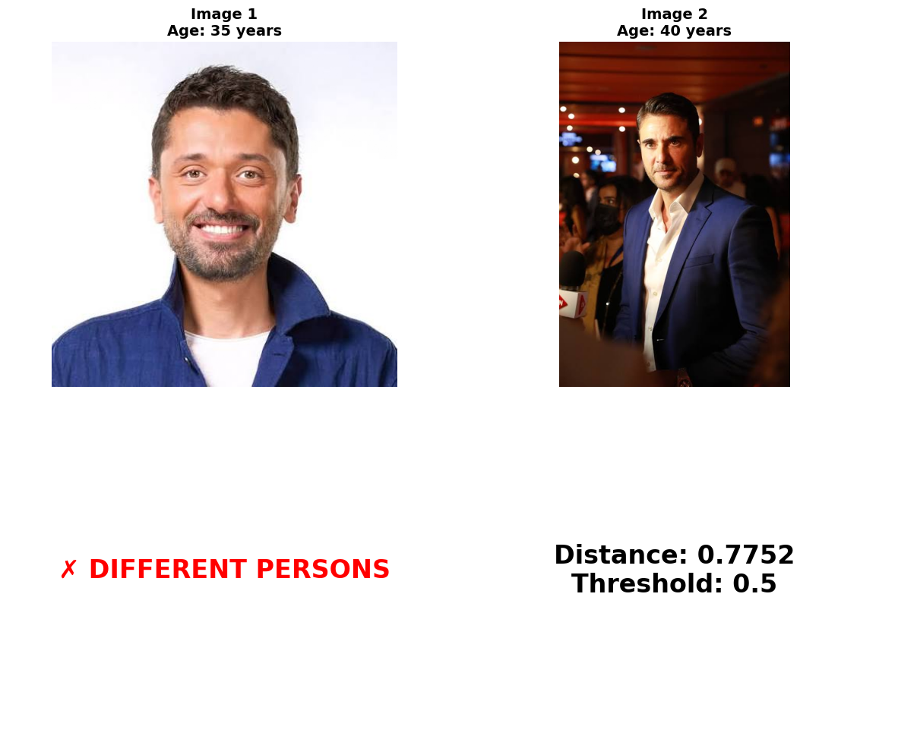

# Face Age Estimation & Verification

A deep learning system for **face age estimation** and **face verification**. The project combines a pre-trained face embedding model with a custom MLP age regression/classification network, and provides a unified pipeline for comparing faces with age-aware confidence scoring.

## Features

- **Face Age Estimation** - MLP model trained on Facenet512 embeddings with dual-output (classification + regression) and ordinal loss
- **Face Verification** - Cosine-distance-based face matching with age estimation for both images
- **Pre-computed Embeddings** - Embeddings cached as `.pkl` files for fast training and inference
- **Hyperparameter Tuning** - Optuna-based multi-GPU hyperparameter search with JournalStorage for concurrent trials

## Table of Contents

- [Architecture](#architecture)
- [Dataset](#dataset)
- [Face Detectors](#face-detectors)
- [Metrics](#metrics)
- [Pipeline](#pipeline)
- [Embeddings & Caching](#embeddings--caching)
- [Augmentation](#augmentation)
- [Hyperparameter Tuning](#hyperparameter-tuning)
- [Age Model - Design Decisions](#age-model--design-decisions)
- [Best Results](#best-results)
- [Sample Outputs](#sample-outputs)
- [Project Structure](#project-structure)
- [Environment](#environment)
- [Installation](#installation)
- [How to Run](#how-to-run)

---

## Architecture

<p align="center">
  
</p>

The pipeline consists of the following steps:

1. **Face Detection** - RetinaFace detects and aligns the face region in each input image
2. **Embedding Extraction** - Facenet512 maps the aligned face to a 512-dimensional vector that captures identity and appearance features
3. **Age Prediction** - The embedding is fed through the age MLP model which outputs a class distribution over 91 age classes (0–90) and a regression value; the argmax of the classification head is used as the predicted age
4. **Verification** - For two images, cosine distance between their embeddings is computed. If the distance is below the threshold, the faces are verified as the same person
5. **Output** - Verification decision, distance score, and estimated ages for both images

---

## Dataset

| Property | Value |
|---|---|
| **Total Images** | 32,173 |
| **Age Range** | 0 – 90 years |
| **Age Classes** | 91 (folders 0–90) |
| **Sources** | UTKFace, FGNET |
| **Train / Val Split** | 80% / 20% (stratified per age class, seed=42) |
| **Train Images** | 25,738 |
| **Val Images** | 6,435 |

### Age Distribution

<p align="center">
  
</p>

### Age Group Breakdown

| Age Group | Range | Count | Percentage |
|---|---|---|---|
| Infant | 0–2 | 1,945 | 6.0% |
| Child | 3–12 | 2,744 | 8.5% |
| Teenager | 13–19 | 2,468 | 7.7% |
| Young Adult | 20–29 | 9,559 | 29.7% |
| Adult | 30–49 | 9,409 | 29.2% |
| Middle-aged | 50–64 | 3,841 | 11.9% |
| Senior | 65–79 | 1,522 | 4.7% |
| Elderly | 80–90 | 685 | 2.1% |

The dataset exhibits significant **class imbalance**: ages 20–49 contain 58.9% of all images, while ages 80–90 have only 685 images (2.1%).

---

## Face Detectors

The project uses **DeepFace** as a unified interface for face detection and embedding extraction. We benchmarked 8 detectors on the full dataset:

| Detector | Detection Rate |
|---|---|
| RetinaFace | 100.00% |
| MTCNN | 100.00% |
| YOLOv8n | 100.00% |
| YOLOv11n | 100.00% |
| OpenCV | 100.00% |
| Dlib | 100.00% |
| YuNet | 100.00% |
| CenterFace | 99.78% |

**RetinaFace** is used as the default detector for embedding extraction based on its strong performance in face recognition benchmarks. On the [LFW dataset](https://www.kaggle.com/datasets/jessicali9530/lfw-dataset), the Facenet512 + RetinaFace combination achieves **98.4%** accuracy, surpassing the human baseline of 97.5%.

### Performance Matrix with Different Face Recognition Models and Detectors on [LFW Dataset](https://www.kaggle.com/datasets/jessicali9530/lfw-dataset)


| | Facenet512 |Facenet |VGG-Face |ArcFace |Dlib |GhostFaceNet |SFace |OpenFace |DeepFace |DeepID |
| --- |  --- | --- | --- | --- | --- | --- | --- | --- | --- | --- |
| retinaface |**98.4** |96.4 |95.8 |96.6 |89.1 |90.5 |92.4 |69.4 |67.7 |64.4 |
| mtcnn |**97.6** |96.8 |95.9 |96.0 |90.0 |89.8 |90.5 |70.2 |66.3 |63.0 |
| fastmtcnn |**98.1** |97.2 |95.8 |96.4 |91.0 |89.5 |90.0 |69.4 |67.4 |63.6 |
| dlib |97.0 |92.6 |94.5 |95.1 |96.4 |63.3 |69.8 |75.8 |66.5 |58.7 |
| yolov8 |97.3 |95.7 |95.0 |95.5 |88.8 |88.9 |91.9 |68.7 |67.5 |65.9 |
| yunet |**97.9** |97.4 |96.0 |96.7 |91.6 |89.1 |91.0 |70.9 |66.5 |63.5 |
| centerface |**97.7** |96.8 |95.7 |96.5 |90.9 |87.5 |89.3 |68.9 |67.8 |63.6 |
| mediapipe |96.1 |90.6 |92.9 |90.3 |92.6 |64.3 |75.4 |78.7 |64.8 |63.0 |
| ssd |88.7 |87.5 |87.0 |86.2 |83.3 |82.2 |84.5 |66.8 |63.8 |62.6 |
| opencv |87.6 |84.9 |87.2 |84.6 |84.0 |85.0 |83.6 |66.2 |63.7 |60.1 |
| skip |91.4 |67.6 |90.6 |54.8 |69.3 |78.4 |83.4 |57.4 |62.6 |61.1 |
---


### Bounding Box Comparison

The figure below shows the bounding boxes produced by each detector on a challenging image with partial occlusion (hand covering part of the face) and tight cropping. **RetinaFace** (1.00 confidence) and **MTCNN** (1.00) produce the tightest, most accurate boxes that fully enclose the face while handling the occlusion gracefully. Other detectors either cut off parts of the face (Dlib, YOLOv8n, YOLOv11n) or include excessive background (OpenCV, YuNet, CenterFace).

<p align="center">
  
</p>

## Metrics

### Age Estimation Metrics

| Metric | Description |
|---|---|
| **MAE** | Mean Absolute Error in years - lower is better |
| **Error Std** | Standard deviation of signed errors - measures consistency |
| **Acc** | Exact Match |
| **Acc ±3** | Predictions within ±3 years of true age |
| **Acc ±5** | Predictions within ±5 years of true age |
| **Acc ±10** | Predictions within ±10 years of true age |


### Verification Metrics

| Metric | Description |
|---|---|
| **Cosine Distance** | `1 - cosine_similarity(emb1, emb2)` - ranges from 0 (identical) to 2 (opposite) |
| **Threshold** | Distance threshold for verification decision (default: 0.5) |
| **Verified** | `True` if distance <= threshold |

---

## Embeddings & Caching

Computing Facenet512 embeddings for 32k+ images is expensive (~ 30+ minutes on GPU). To avoid re-computing embeddings during every training or tuning run, embeddings are **pre-computed once** and saved as pickle files.

### Embedding Format

Each `.pkl` file contains a list of tuples:

```python
[(embedding, age), ...]
# embedding: list of 512 floats (Facenet512)
# age: string "0" to "90"
```

### Files

| File | Description |
|---|---|
| `train_embeddings.pkl` | Training embeddings (25,738 samples) |
| `val_embeddings.pkl` | Validation embeddings (6,435 samples) |
| `train_embeddings_aug.pkl` | Augmented training embeddings (39,083 samples) |

### Encoding

```bash
# Standard embeddings
python encode.py          
# → train_embeddings.pkl, val_embeddings.pkl

# Augmented embeddings
python encode_aug.py      
# → train_embeddings_aug.pkl
```

During training and tuning, the model loads embeddings directly from `.pkl` files instead of processing raw images, reducing epoch time from minutes to seconds.

---

## Augmentation

To address the severe class imbalance (ages 80–90 have only 685 images vs. ages 20–29 with 9,559), we apply **targeted augmentation** to minority classes.

### Strategy

- **Target**: Classes below the median class count
- **Method**: Apply each augmentation independently with **60% probability** per image
- **Pipeline**: Augment the image *before* embedding, then the augmented image is passed through Facenet512 to produce the new embedding

### Augmentation Types

- Horizontal Flip
- Brightness Up
- Brightness Down
- Gaussian Blur
- Gaussian Noise

### Result

| Metric | Value |
|---|---|
| Original train embeddings | 25,738 |
| Augmented train embeddings | 39,083 |
| Augmentation probability | 0.6 per type |
| Random seed | 42 |

This yields a ~52% increase in training samples, concentrated in underrepresented age groups.

---

## Hyperparameter Tuning

Hyperparameter tuning is performed with **Optuna** across **4 GPUs** simultaneously.

### Configuration

| Parameter | Search Space |
|---|---|
| Learning rate | 1e-5 to 1e-2 |
| Weight decay | 1e-6 to 1e-3 |
| Alpha (ordinal loss) | 0.1 to 0.9 |
| Batch size | {32, 64, 128} |
| Epochs | 50 to 150 |
| Dropout | 0.1 to 0.5 |

### Multi-GPU Strategy

- Trials are round-robin assigned to GPUs.
- **JournalStorage** (`JournalFileStorage`) is used instead of (`SQLite`) to allow concurrent writes from multiple processes
- Each trial saves its best checkpoint to `checkpoints/TUNE/trial_N/best.pth`
- 100 trials total, with early stopping (patience=20) per trial

### Running

```bash
cd age_model
python tune.py
```

### Comet ML Logging

Every trial is logged to **Comet ML** in real time, hyperparameters, per-epoch metrics (loss, accuracy, ±3/±5/±10), and the best checkpoint are uploaded automatically. Each trial appears as a separate experiment, making it easy to compare runs side-by-side.

All 100 experiments can be explored live at:

**[https://www.comet.com/youssefaboelwafa/face-matching/](https://www.comet.com/youssefaboelwafa/face-matching/)**

### Training Progress Across All Trials

The following charts show `train_acc_3` and `val_acc_3` over epochs for every trial, illustrating how different hyperparameter configurations converge:

<p align="center">
  
  <caption>Train Acc ±3 across all 100 hyperparameter trials. Each line represents a single trial.</caption>
</p>

<p align="center">
  
  <caption>Validation Acc ±3 across all 100 hyperparameter trials. Each line represents a single trial.</caption>
</p>

Most trials converge within the first 20–30 epochs, with the best configurations reaching ~45–50% train_acc_3 and ~44–45% val_acc_3. The spread in early-epoch performance highlights the sensitivity to learning rate and dropout choices.

---

## Age Model Design Decisions

### Architecture

```
Input (512-dim Facenet512 embedding)
  |
  Linear(512 → 512) → BatchNorm → ReLU → Dropout(0.3)
  |
  Linear(512 → 256) → BatchNorm → ReLU → Dropout(0.3)
  |
  Linear(256 → 128) → BatchNorm → ReLU → Dropout(0.21)
  |
  Linear(128 → 64)  → ReLU
  |
  ├── Classifier: Linear(64 → 91)   # Age class logits
  └── Regressor:  Linear(64 → 1)    # Continuous age value
```

### Why This Design?

**1. Embedding-based (not image-based) model**

Instead of training a CNN on raw pixels, we operate on Facenet512 embeddings. This means:
- No need for a GPU during training/inference of the age model
- Leverages the rich facial features already captured by Facenet512
- Training runs in seconds per epoch on pre-computed embeddings
- The model is lightweight (~500K parameters)

**2. Dual-output heads (classification + regression)**

Age has both categorical and continuous properties:
- **Classification head** (91 classes) captures the discrete nature of age labels and provides a probability distribution
- **Regression head** (1 value) captures the ordinal, continuous nature of age
- During inference, the classification head's argmax is used as the predicted age

**3. Ordinal Loss**

```
L = α * CrossEntropy + (1 - α) * MSE
```

- **CrossEntropy** trains the classification head to discriminate between age classes
- **MSE** trains the regression head to produce a continuous age estimate
- **α** balances the two objectives (best α = 0.84 from tuning)
- This joint loss encourages the shared backbone to learn features useful for both tasks

**4. Model selection on val_acc_3**

Rather than selecting the best model by exact accuracy or loss, we use **±3 years accuracy** as the primary metric because:
- Exact age prediction is inherently noisy (labels are approximate)
- ±3 years is a more practical and meaningful measure of performance
- It rewards models that are "close enough" rather than penalizing off-by-one predictions

---

## Best Results

### Hyperparameters (Trial 70 of 100)

| Hyperparameter | Value |
|---|---|
| Learning rate | 0.00502 |
| Weight decay | 6.25e-06 |
| Alpha (ordinal loss) | 0.838 |
| Batch size | 64 |
| Epochs | 86 |
| Dropout | 0.428 |

### Evaluation Metrics

| Metric | Value |
|---|---|
| **MAE** | 5.81 years |
| **Error Std** | 8.49 years |
| **Exact Match** | 14.69% |
| **Acc ±3** | **46.11%** |
| **Acc ±5** | 61.43% |
| **Acc ±10** | 83.72% |

### Age Group Performance

| Group | MAE | Acc ±5 |
|---|---|---|
| Child (<18) | 3.87 | 77.45% |
| Adult (18–60) | 5.75 | 60.24% |
| Elderly (>=60) | 10.14 | 37.80% |

The model performs best on children, where facial features change rapidly and are more distinctive. Performance degrades on elderly faces due to the severe underrepresentation of this age group in the training data (only 2.1% of images).

---

## Sample Outputs

### Verification Example 1

<p align="center">
  
</p>

### Verification Example 2

<p align="center">
  
</p>

### Verification Example 3

<p align="center">
  
</p>

---

## Project Structure

```
Face-Matching/
├── encode.py               # Generate embeddings from raw images
├── encode_aug.py           # Generate augmented embeddings for minority classes
├── verify.py               # Face verification with age estimation
├── verify.ipynb            # Jupyter notebook with visual verification
├── config.py               # All absolute paths
├── utils.py                # Save/load embedding pickle files
├── requirements.txt        # Python dependencies
│
├── age_model/
│   ├── model.py            # AgeModel (MLP) + OrdinalLoss
│   ├── data.py             # EmbeddingDataset (PyTorch Dataset)
│   ├── train.py            # Training loop with Comet ML logging
│   ├── eval.py             # Evaluation with MAE, accuracy metrics
│   ├── tune.py             # Optuna hyperparameter tuning (multi-GPU)
│
├── detector/
│   ├── test_detectors.py   # Benchmark 8 face detectors
|   ├── test_detectors.ipynb  # Jupyter notebook for visualizing detector results
│   └── detectors_results.csv
│
├── deepface/               # Deepface library
│
├── checkpoints/
│   └──best.pth            # Best model 
│
└── dataset/                # UTKFace + FGNET images
```

---

## Environment

- **Python** 3.10 with Conda
- **PyTorch** with CUDA 12.4
- **TensorFlow** (for DeepFace backends; requires `TF_USE_LEGACY_KERAS=1`)
- **Comet ML** for experiment tracking
- **Optuna** for hyperparameter tuning
- **DeepFace** 
---

## Installation

### 1. Clone the repository

```bash
git clone https://github.com/YoussefAboelwafa/Face-Matching.git
cd Face-Matching
```

### 2. Create Conda environment

```bash
conda create -n face python=3.10 -y
conda activate face
```

### 3. Install PyTorch with CUDA 12.4

```bash
pip install torch torchvision torchaudio --index-url https://download.pytorch.org/whl/cu124
```

### 4. Install project dependencies

```bash
pip install -r requirements.txt
```

### 5. Download the Dataset

Download from HuggingFace: [`YoussefAboelwafa/Face-Age_UTKFACE_FGNET`](https://huggingface.co/datasets/YoussefAboelwafa/Face-Age_UTKFACE_FGNET)

Place the extracted `dataset/` folder at the project root.

### 6. Download the Pre-trained Model and pickle files of embeddings

Download from HuggingFace: [`YoussefAboelwafa/Face-Matching`](https://huggingface.co/YoussefAboelwafa/Face-Matching)

Place `age_model_best.pth` inside `checkpoints/`.
Place `train_embeddings.pkl` and `val_embeddings.pkl` inside the project root.

---

## How to Run

### Generate Embeddings

```bash
# Standard embeddings (all images)
python encode.py

# Augmented embeddings (minority classes with augmentations)
python encode_aug.py
```

### Train the Age Model

```bash
cd age_model
python train.py
```

### Evaluate the Model

```bash
cd age_model
python eval.py --checkpoint age_model_best.pth
```

### Run Inference (Single Image)

```bash
cd age_model
python inference.py --img path/to/image.jpg --checkpoint age_model_best.pth
```

### Face Verification

```bash
python verify.py --img1 path/to/image1.jpg --img2 path/to/image2.jpg --checkpoint age_model_best.pth
```

### Benchmark Face Detectors

```bash
cd detector
python test_detectors.py
```

### Hyperparameter Tuning

```bash
cd age_model
python tune.py
```

---

This project demonstrates that pre-trained face embeddings combined with a lightweight MLP can achieve competitive age estimation without end-to-end image training. The modular design separating embedding extraction from age prediction enables fast iteration, easy augmentation, and straightforward deployment.

## Author

Youssef Aboelwafa - [GitHub](https://github.com/YoussefAboelwafa)

---